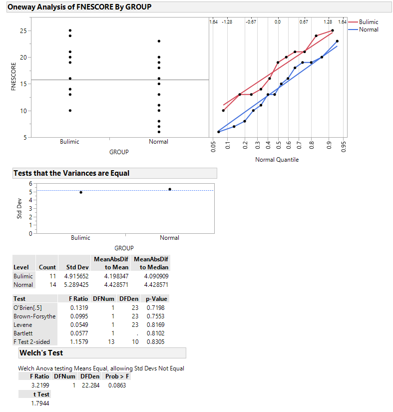
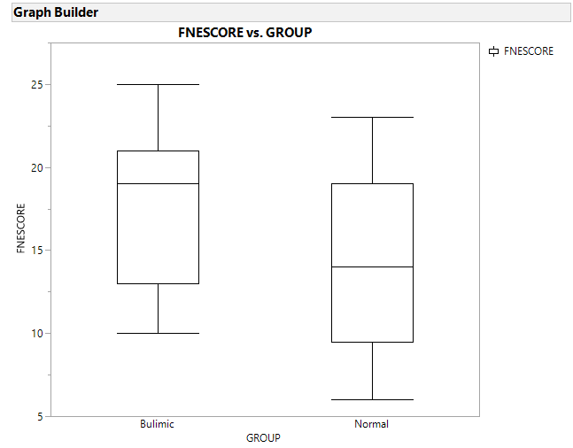
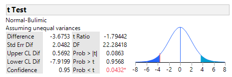

#### Comparing Two Population Means: Independent Sampling (Small Samples)
One experiment reported in The American Statistician wished to see whether women with eating disorders are more fearful of negative evaluation. One sample consisted of 11 students with bulimia and the other sample consisted of 14 students without an eating disorder. Each student completed a questionaire which resulted in a fear of negative evaluation (FNE) score. The higher the score, the greater the fear of negative evaluation. We will use a two sample t-test to see if the true mean FNE score for students with bulimia is higher than the true mean FNE score for people without an eating disorder.

#### Conditions Required for Valid Small-Sample Inferences about (u1-u2)

1. The two samples are randomly selected in an independent manner from the two target populations.
2. Both sampled populations have normal distributions.
3. The population variances are equal.






Since both of our sample sizes are less than 30, the CLT says that the sampling distribution of (u1-u2) will not be normal and our sample variances will not be good approximations for our population variances when the sample size is small. We can however use the t-distribution if the above requirements are met.

From the information given, we will assume the samples are random and independent. To check the second assumption, we use a normal probability plot which tells us that the sampled populations are normal so we can assume the second assumption has been fulfilled. For the last assumption, we look at boxplots and conduct tests of equal variance which shows that the variances are equal. 

#### Hypotheses for Small Independent Samples Test for (u1-u2)
Let the true mean FNE score for female students with bulimia be u1 and the true mean FNE score for female students without an eating disorder be u2. We will be using a level of significance of 0.05.

Ho: u1 - u2 = 0

Ha: u1 - u2 > 0


#### Student's t-Statistic

In our example, we will use x-bar1 - xbar2 as a point estimator for u1-u2.  To find the t statistic, we need to know the standard error of x-bar1 - xbar2. When two samples are independent, the standard error is equal to sqrt (σ2/n1 + σ2/n2). Using the null hypothesis value, we can form the t statistic with the formula x-bar1 - xbar2 - 0 / sqrt ( o2/n1 + σ2/n2 ). 

Since the population variances are equal, we can use a pooled sample estimator for σ2. Usually we would use each individual sample variance to estimate each populations variance but taking the weighted average of the sample variances will give a more accurate estimate for the population variance of each population. 

In this problem, the pooled sample estimator for σ2 is about 26.3. Using the formula, our t-statistic is 1.78. 


### Test of Hypothesis for (u1 - u2)

The t criticial value corresponding to an area of 0.05 and a df of 23 is 1.714. Since our t-statistic is greater than 1.714, we can reject the null hypothesis and that the true mean FNE score for female students with bulimia is higher than the true mean FNE score of students without eating disorders. Looking at a table, we see that our t-statistic is between t(0.05) and t(0.025) for a df of 23. This means that our p-value is between 0.05 and 0.025.


Using the formula for a 95% one sided confidence interval, we get 3.68 - 3.54. We are 95% confident that the true mean FNE score for female students with bulimia is (0.14, Inf) higher than the true mean FNE score of students without eating disorders. 

Doing the test in JMP and R, we get similiar answers. Note that in JMP, the population are switched but we come to the same answer. In R, we seperate the groups into vectors and than conduct the test. Note `var.equal=TRUE` means that we are assuming equal variances. 



```
library(tidyverse)

students <- read.csv("BULIMIA.csv",header = TRUE)


normal <-students %>%
  filter(GROUP=="Normal")

bulimc <- atudents %>%
  filter(GROUP=="Bulimic")


t.test(bulimc$FNESCORE,normal$FNESCORE,alternative = "greater",conf.level = .95,var.equal = TRUE)

### Two Sample t-test

### data:  bulimc$FNESCORE and normal$FNESCORE
### t = 1.7781, df = 23, p-value = 0.04431
### alternative hypothesis: true difference in means is greater than 0
### 95 percent confidence interval:
### 0.1326808       Inf
### sample estimates:
### mean of x mean of y 
### 17.81818  14.14286 
```


